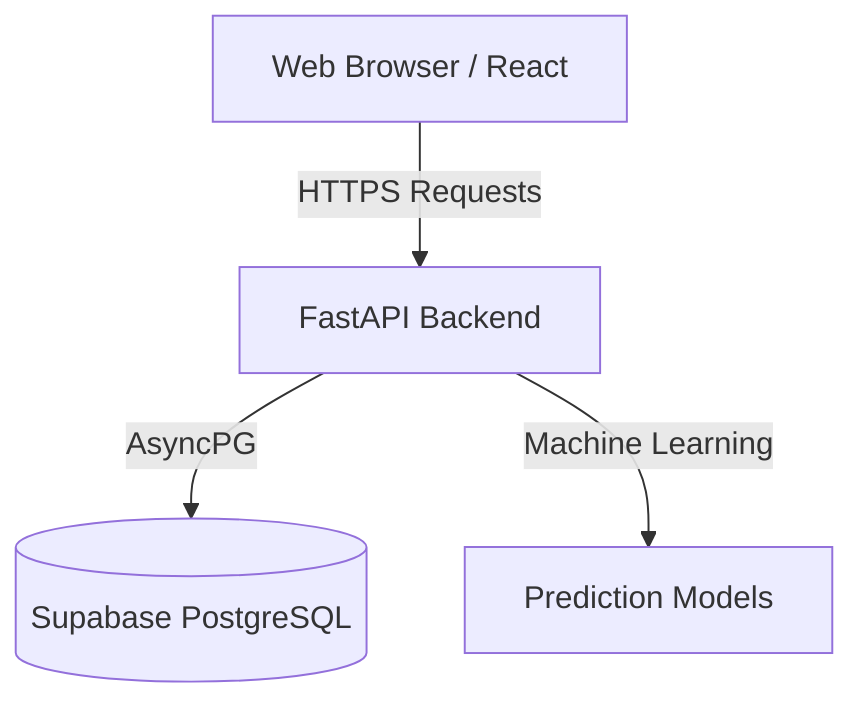

# Gridflow Architecture

Gridflow is a predictive event congestion optimizer designed to forecast road network load and recommend mitigation strategies for city events.

## High-Level Architecture

The system is built as a modernized full-stack web application with three primary layers:
1. **Frontend Presentation Layer** (React + Vite)
2. **Backend Application Layer** (FastAPI)
3. **Data Persistence Layer** (PostgreSQL on Supabase)

## Tech Stack Breakdown

### Frontend (Client)
- **Framework:** React 18 with Vite
- **Styling:** Tailwind CSS (with custom tactical "Console" theme)
- **Maps & Routing:** Leaflet (`react-leaflet`) and OSRM (Open Source Routing Machine) API
- **State Management:** React Context (`AuthContext`, `EventContext`)
- **Hosting:** Vercel

### Backend (API Server)
- **Framework:** FastAPI (Python)
- **ORM:** SQLAlchemy (Async mode)
- **Database Driver:** `asyncpg` with `NullPool` to prevent connection exhaustion in serverless environments.
- **Hosting:** Vercel Serverless / Render

### Database
- **Provider:** Supabase
- **Type:** PostgreSQL
- **Key Tables:** `events`, `predictions`, `validations`

## Core Workflows

1. **Forecasting (Inference):**
   - The user submits an event (type, location, expected crowd size).
   - The React frontend sends a POST request to the FastAPI backend.
   - The backend runs the ML inference pipeline to predict a congestion risk score and estimated delay.
   - The prediction is stored in the database and returned to the UI.

2. **Recommendations & Routing:**
   - Based on the risk score, the backend generates dynamic recommendations for manpower and barricades.
   - The frontend uses the predicted location to plot affected routes and diversions using Leaflet and the OSRM routing engine.

3. **Validation Loop:**
   - After the event concludes, officers log the *actual* congestion and delay.
   - The backend computes an accuracy percentage, which feeds the Analytics dashboard.
   - This "human-in-the-loop" feedback allows the ML model to track its performance over time.
